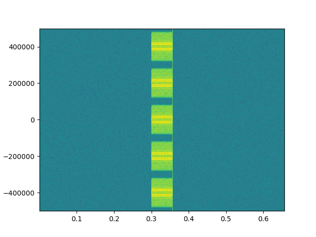
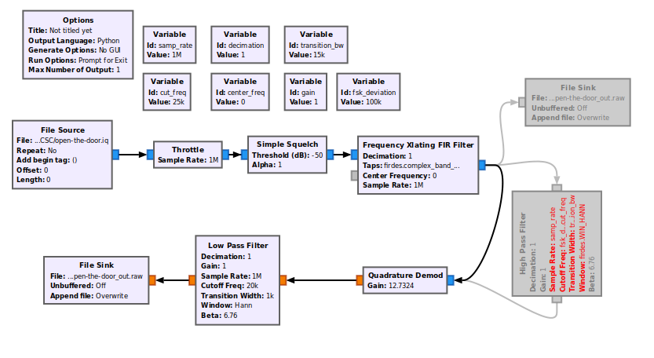
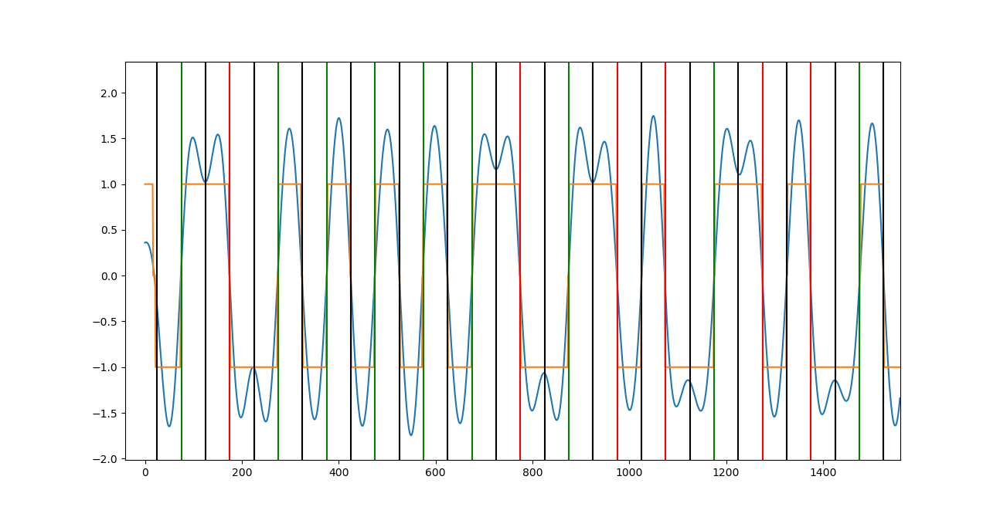
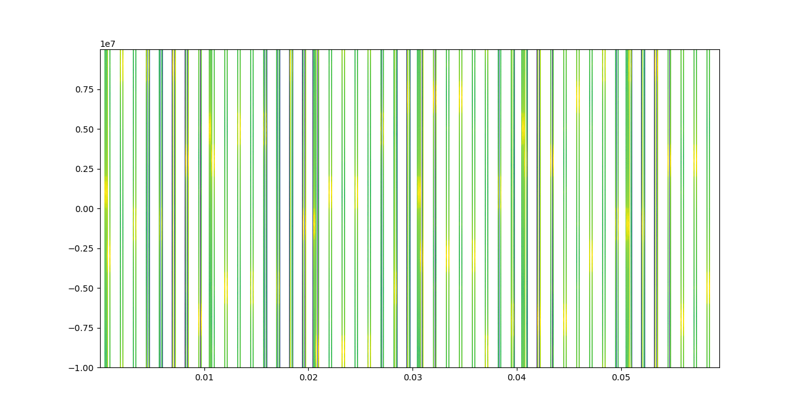
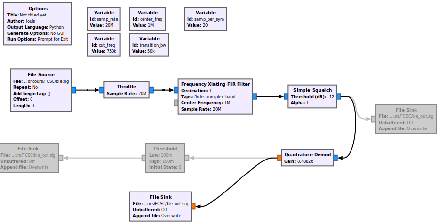
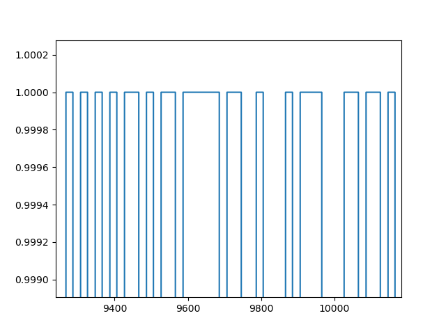

# Solution aux challenges Hardware
Par loulous24

J'ai décidé d'écrire une correction de tout ceux de la catégorie, ceux voulant s'y essayer pourront trouver tout à leur disposition...

## Quarantine

On commence par un challenge assez simple mais intéressant à faire rapidement.

Concentrons nous sur la structure de ce système. On voit que les blocs à gauche sont sauf en haut en bas tous les mêmes. Ils prennent deux bits en entrée et sortent deux bits. Un rapide test sur toutes les valeurs possibles de ces deux bits nous montre que c'est un simple échangeur. Le bit du haut devient celui du bas et inversement.

Le bloc du haut et le bloc du bas à gauche sont presque identiques, ils renvoient des résultats opposés. Celui en haut renvoie toujours 0 et l'autre toujours 1.

Les deux colonnes du milieu servent à propager les constantes du haut et du bas qui sont toujours les mêmes. Une des entrées de chaque bloc de sortie est donc fixée à l'avance et l'autre entrée correspond à un bit du vecteur d'entrée.

Enfin, tout les blocs à droite sont les mêmes et prennent deux entrées et ont un bit en sortie. Un test rapide en fonction de leur entrée nous montre qu'il s'agit simplement d'un XOR qui est à 1 si les deux bits en entrée sont différents.

L'opération totale correspond donc à prendre le vecteur en entrée, échanger ses bits par blocs de deux et le sommer avec un bloc constant. On remarque qu'avec l'exemple fournit ça fonctionne. Étant donnée une sortie, il faut faire les opérations dans l'autre sens. Pour annuler la somme par un vecteur constant, il suffit d'ajouter ce vecteur constant. Ensuite, on échange les bits deux par deux et obtient le résultat.

## NECessIR

Un bon petit challenge pour se mettre en jambe sur la longue route du traitement du signal...

On en profite pour découvrir deux outils fabuleux pour ce type de challenge, `audacity` et `python` (on peut même utiliser un peu baudline pour voir le spectre)

Pour utiliser Audacity, il faut comprendre comment ouvrir un fichier RAW sans header. Il suffit de Faire `Importer -> Données brutes`. Un rapide man de arecord nous apprend comment les paramètres à fournir à Audacity, on est en Big Endian, sur 16 bits signés avec un seul canal. Le fichier s'ouvre bien, on peut voir le signal qui correspond à un tout ou rien fréquentiel.

On peut démoduler ce genre de chose avec Audacity en utilisant Nyquist. On tape la commande `(s-abs s)` pour avoir la valeur absolue de notre signal. On le fait passer dans un filtre passe bas pour couper la fréquence de la porteuse (la fréquence de chaque paquet initiallement). Enfin pour avoir des 0 et des 1, on amplifie avec un gain démesuré. On obtient un joli signal en 0 et en 1. Il est prêt pour Python. On peut l'exporter en RAW avec les mêmes options qu'à l'entrée.

On importe dans Python avec `np.fromfile(x, dtype=">i2")`. Une recherche sur le fonctionnement des télécommandes infrarouge nous donne une explication du décodage. [Encodage IR](https://electronics.howstuffworks.com/remote-control2.htm). Dans Python, on détecte donc les montées et les descentes et on mesure la distance en échantillons entre deux.

```python3
import numpy as np

t = np.fromfile("ir-signal-audacity.raw", dtype="<i2")
signe = t[0] >= 0
iDescente = 0
periode = []
for i in range(1, len(t)):
	if t[i] < 0 and signe:
		iDescente = i
		signe = False
	if t[i] >= 0 and not signe:
		p = i-iDescente
		periode.append(p)
		signe = True

bits = [[],[],[],[]]
i = 0
for p in periode:
	if p > 40000:
		i += 1
	if p > 100 and p < 120:
		bits[i].append('0')
	elif p > 315 and p < 335:
		bits[i].append('1')

nombres = bits[0]
print(''.join([chr(int(''.join(nombres[a:a+8]), 2)) for a in range(0,len(nombres), 8)]))
```
On peut utiliser Cyberchef pour finir et obtenir le flag !

## Un contrôleur sCANdALeux

Le début de ce type de challenge est toujours très canonique. On importe les données dans python et on trace le graphe spatial et temporel.

```python3
data = numpy.fromfile("open-the-door.iq", dtype=numpy.complex64)
plt.figure(1)
plt.specgram(data, Fs=sampling_freq, NFFT=2**10, pad_to=2**15)
plt.figure(2)
plt.plot(data)
```

On ne voit pas grand chose en temporel à part que la capture est trop grande. On peut la recouper avec Audacity en important des données RAW sur deux canaux (on est en complexe) et 32 bit (la partie réelle et imaginaire sont des float 32 bits). Sur le graphe fréquentiel, on voit clairement cinq canaux de largeur On comprend ainsi mieux le titre du challenge. De plus, chaque canaux comprend deux fréquences. On pense donc tout de suite à de la modulation FSK.



Gnu radio ne marchant pas très bien chez moi, je suis obligé de générer un fichier python et de le lancer dans un terminal. Cela me permettra plus tard avec quelques modifications d'automatiser le décodage sur les 5 canaux en même temps. Pour éliminer le bruit hors du signal initial, je place un squech au début. Il permet de réduire à 0 un signal trop faible. Ensuite je sélectionne le canal et je le translate pour faire un démodulation avec Quadrature Demod. Le signal doit toujours rester complexe avant la démodulation car il a des fréquences négatives. Je passe un filtre passe bas pour éliminer les résidus de la démodulation.



On obtient un nouveau signal dans python, rebelote, on trace le spectre et le signal temporel. Ici seul le signal temporel est intéressant. On remarque que ce signal est binaire donc on approche du but. Une analyse de stéganographie classique à base de mesure du nombre de bigrammes et de trigrammes que 000 et 111 n'apparaissent jamais si on décode en tout ou rien directement. Quelques recherches en encodage mènent sur la piste du Manchester code. J'ai représenté en noir chaque bloc contenant un symbole et en vert les 0 et en rouge les 1.



Il ne reste plus qu'à décoder les caractères en Unicode. Quatre des cinq canaux contenaient des références à la pop culture en terme d'ouverture de porte. Le dernier contenait le flag.

Pour décoder le Manchester, on quantifie les données puis on utilise le fait qu'on a un symbole tout les 100 échantillons, ici c'est très stable donc on n'a pas besoin d'adapter la fenêtre. Ensuite, on regarde si on est dans une montée ou une descente.

```python3
iChange = 0
while iChange + 75 < len(data_quant):
	if data_quantifie[iChange+25] < 0 and data_quantifie[iChange+75] > 0:
		binaire.append(0)
	elif data_quantifie[iChange+25] > 0 and data_quantifie[iChange+75] < 0:
		binaire.append(1)
	else:
		print(iChange) #on a obtenu une erreur
	iChange += 100
```

## Bluetooth Low Energy

On entre dans le dur avec celui là !! Le début est similaire à ce que j'ai fait pour le précédent, on trace le spectre et le signal temporel. On peut le voir aussi avec `audacity` ou avec `baudline` en exportant en `.wav` dans Audacity.



On remarque de nombreux paquets en fréquentiel, on les retrouve en temporel et on se rend compte que chaque paquet a une fréquence qui change. C'est tout à fait normal après la lecture de la [documentation de bluetooth](https://www.mouser.it/pdfdocs/bluetooth-Core-v50.pdf). On peut se restreindre à la partie sur Bluetooth Low Energy, c'est très instructif. Il s'agit en fait du processus de frequency hopping. Cela consiste à changer de canal de fréquence à chaque paquet. Le seul moyen de le décoder est de capturer l'ensemble du spectre de Bluetooth en même temps, d'où la désactivation du filtre anti-repliement dans la capture du fichier. Bien que le théorème de Shanon-Nyquist nous interdit d'avoir des fréquences en-deçà de -f_e/2 et au delà de f_e/2. Donc ici en dessous de 2471 MHz et au dessus de 2451 MHz. Replier nous permet de choper les autres fréquences.

La méthode de décodage de la GFSK (utilisée par Bluetooth) est sensiblement la même que la FSK avec Gnu Radio. Voici le nouveau flowgraph que j'ai utilisé, il ressemble beaucoup au précédent. Seul la présence d'un squelch est à noter. Il permet de couper et de mettre à 0 un signal qui ne dépasse pas un certain seuil. Ça évite le bruit en sortie du Quadrature Demod.



Le signal qu'on obtient en sortie est assez propre et on reconnaît même la trame de bluetooth constitué de 0 et de 1.



Certains des paquets font 80 bits et d'autre beaucoup plus. Quand on regarde la trame avec des recherches (ou dans la doc, lisez-là c'est très intéressant), on remarque que les paquets de 80 bits de correspondent à aucune donnée utile ici. Seuls ceux de plus de bits nous intéressent. Il y en a 6 et on remarque qu'ils ont tous été envoyé dans les fréquences correspondant aux canaux d'annonces. On comprend maintenant une partie de l'énoncé.


Malheureusement, les ennuis commencent maintenant. On se rend aussi compte de l'existence du whitening. Le LL Header, la Data et le CRC ont subi un xor avec des données pseudo-aléatoires (pour éviter d'avoir trop de 0 ou trop de 1 d'un coup). Or ces données pseudos-aléatoires sont générés à partir d'une graine que je n'ai pas réussi à déterminer. Heurseusement, la graine de génération des données pseudo-aléatoires ne fait que 7 bits donc un bruteforce rapide permet d'y arriver. Pour être sûr que les données sont les bonnes, on vérifie que la longueur du paquet après le de-whitening est valide. La méthode utilisé pour générer aléatoirement la suite s'appelle LFSR pour Linear Feedback Shift Register. Le code pour BLE est le même que pour Bluetooth. Seulement la fonction que j'ai codée ne me permettait de décoder que quatre paquets sur les 6 et j'ai obtenu les 2/3 du flag. Une autre fonction trouvée sur internet m'a permis de décoder les autres (mais elle ne marche pas pour 2 des quatre paquets que j'avais décodé). J'ai vu après coup dans la documentation qu'on avait les tables générées directement, c'est plus gourmand en espace.

```python3
def LFSR1(n):
	n &= 0b1111111
	x = 0
	n <<= 1
	if n & 0x80:
		n ^= 0x11
		x = 1
	n &= 0b1111111
	return n, x

def LFSR2(n):
	# n &= 0b1111111
	x = 0
	if n & 0x80:
		n ^= 0x11
		x = 1
	n <<= 1
	# n &= 0b1111111
	return n, x
```

On trouve alors le flag coupé en trois morceaux sur trois paquets différents.

[Ce lien](http://summit.sfu.ca/system/files/iritems1/12931/etd7784_CKilgour.pdf) explique aussi assez bien la méthode globale mais ne rentre pas assez dans les détails je trouve. [RIEN NE VAUT 3000 pages de doc.](https://www.bluetooth.org/docman/handlers/downloaddoc.ashx?doc_id=478726)

[N'hésitez pas à voir ce write-up pour plus de détails techniques de physique du signal !](https://github.com/tchup-dev/FCSC-2020)
