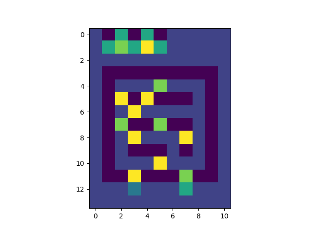
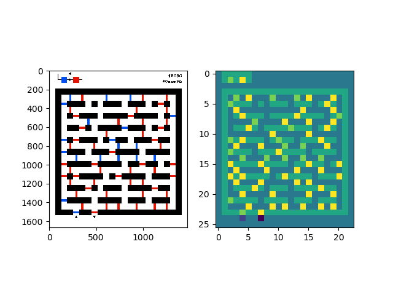

# Solution aux challenges Misc
Par loulous24

## Mazopotamia

Ce challenge n'est pas tant compliqué par la difficulté de trouver un algorithme de résolution que par la méthode pour converser avec le serveur et réussir à comprendre l'image.

#### Discuter avec le serveur

Pour échanger avec le serveur et obtenir une image, j'ai utilisé les modules `socket`, `matplotlib` et `base64`. On initialise une connexion avec le serveur, on écrit une fonction pour pouvoir lire toutes les données jusqu'à recevoir une string en particulier et on convertit avec `matplotlib.image`

```python3
HOST = 'challenges2.france-cybersecurity-challenge.fr'
PORT = 6002

def recv_all(sock, string, size, afficher=False):
	data = ''
	while data[-len(string):] != string:
		data_recv = sock.recv(4096)
		data += data_recv.decode('utf-8')
		if afficher:
			print(data_recv.decode('utf-8'),end='')
	return data

def convert_maze(entree):
	debut = "------------------------ BEGIN MAZE ------------------------"
	fin = "------------------------- END MAZE -------------------------"
	infos = entree.split("\n")
	for i in range(len(infos)):
		if infos[i] == debut:
			break
	if infos[i] != debut:
		return None
	for j in range(i+1,len(infos)):
		if infos[j] == fin:
			break
	if infos[j] != fin:
		return None
	maze64 = "".join(infos[i+1:j])
	mazebytes = io.BytesIO(b64d(maze64))
	return mpimg.imread(mazebytes, format="PNG")

with socket.socket(socket.AF_INET, socket.SOCK_STREAM) as sock:
	sock.connect((HOST,PORT))
	data = recv_all(sock, "...", 4096)
	sock.sendall(b"\n")
	for i in range(31):
		data = recv_all(sock, ">>> ", 4096)
		maze = convert_maze(data)
		sock.sendall(resultat_str.encode() + b'\n') # resultat_str est ce que je calcule
```

#### Convertir son labyrinthe en un objet plus simple

On se rend compte que les blocs du labyrinthe sont toujours carrés de taille 64px. On construit donc une fonction pour reconnaître les portes, les blocs noirs, les blocs blancs, la croix et les blocs du haut pour simplifier le problème. Les portes ont un nombre positif qui leur est associé dans l'ordre fourni et les blocs spéciaux un nombre négatifs. Pour déterminer l'objet, on regarde la couleur de son centre. pour les flèches, on regarde des points particuliers du bord qui sont toujours de la même couleur...

```python3
doors = dict()

def color_door(c):
	if c not in doors.keys():
		doors[c] = len(doors)
	return doors[c]

def read_block(maze, i, j):
	i_image = 64*i
	j_image = 64*j
	center = list(maze[i_image+32][j_image+31])
	white = [255, 255, 255]
	black = [0, 0, 0]
	grey_dark = [128,128,128]
	grey_bright = [239,239,239]
	if center == grey_dark: #down arrow
		return -4
	if center == white: #white block
		return -2
	if center != black: #color door
		return color_door(tuple(center))
	if list(maze[i_image+2][j_image+31]) == grey_bright: #up arrow
		return -3
	else: #black block
		return -1

x_dim, y_dim, _ = maze.shape
x_dim //= 64
y_dim //= 64
maze_simple = np.zeros((x_dim, y_dim), dtype=np.int8)
for x in range(x_dim):
	for y in range(y_dim):
		maze_simple[x][y] = read_block(maze, x, y)
```

On obtient cette simplification





#### Le parcours de graphe

C'est un problème classique de parcours de graphe à partir de maintenant. Il faut juste adapter quelques spécificités liées au problème, à savoir qu'on ne reste pas sur un portail et qu'à tout moment (sauf au début) on peut avoir une couleur qui nous est associé et correspond à la couleur du dernier portail traversé. On effectue un parcours en profondeur avec un tableau de visite un peu particulier puisqu'il nous dit si sur une case, on est déjà passé par là avec la même couleur car revenir au même endroit avec une même couleur est inutile alors qu'avec une autre couleur, ça peut être nécessaire.

```python3
seen = []
for x in range(x_dim):
	seen.append([])
	for y in range(y_dim):
		seen[-1].append([])
		seen[-1][-1] = [False]*len(doors) # len(doors) est le nombre de couleurs
```

J'ai codé une fonction de visite qui va visiter la case suivante étant donné une direction et qui garde en mémoire dans `path` tout le chemin parcouru. `dir` est un tuple dont la première coordonnée est le nom de la direction, la deuxième le déplacement selon `x` et la troisième selon `y`.

```python3
def visiter(maze, seen, path, x, y, colour, dir, x_dim, y_dim):
	x += dir[1]
	y += dir[2]
	if x < 0 or y < 0 or x >= x_dim or y >= y_dim:
		return None
	if maze[x][y] == -1 or maze[x][y] == -3: # on ne peut pas revenir sur le départ
		return None
	if maze[x][y] >= 0: #on rencontre une porte
		if colour != -1 and (maze[x][y] - colour) % len(doors) != 1:
			return None
		return visiter(maze, seen, path, x, y, (colour + 1) % len(doors), dir, x_dim, y_dim)
	if seen[x][y][colour]:
		return None
	seen[x][y][colour] = True
	path.append(dir[0])
	if maze[x][y] == -4: # on a gagné
		return path
	for dir in {('N',-1,0), ('S',1,0), ('W',0,-1), ('E',0,1)}:
		nouvelle_visite = visiter(maze, seen, path, x, y, colour, dir, x_dim, y_dim)
		if nouvelle_visite is not None:
			return nouvelle_visite
	path.pop()
	return None

resultat = visiter(maze_simple, seen, [], x_depart, y_depart, -1, ('N',-1,0), x_dim, y_dim)
resultat_str = "".join(resultat)
```
On retrouve le `resultat_str` qu'on voulait envoyer au début, la boucle est bouclée.

## Clepsydre

Il s'agit d'un time base crack, on déduit des informations du temps mis par le serveur pour répondre. Je réutilise la même fonction pour recevoir les données sauf que je lui fait soulever une erreur quand on atteint le flag, elle ne fait rien sinon. Cela permet aisément d'arrêter le programme sans rétropropager des réponses de fonction pour arrêteraient le processus.

J'ai une fonction pour mesurer le temps pris par une demande de mot de passe qui recrée une connexion à chaque fois.

```python3
def tester(string):
	debut = time.time()
	with socket.socket(socket.AF_INET, socket.SOCK_STREAM) as sock:
		sock.connect((HOST,PORT))
		recv_all(sock, " : ", 256)
		sock.send(string.encode() + b'\n')
		recv_all(sock, " !\n\n", 256)
	fin = time.time()
	return fin - debut
```

Et enfin, j'augmente la taille de ma string petit à petit avant de trouver le flag. Il faut comprendre que plus on a de caractères du mot de passe, plus le temps mis par le serveur pour répondre est grand (une seconde pour un caractère, deux secondes pour deux etc...).

```python3
string_possible = ''
while True:
	new_string_possible = ''
	for i in "!^)({})°_-#~|$&@<>*[]`" + "abcdefghijklmnopqrstuvwxyzABCDEFGHIJKLMNOPQRSTUVWXYZ0123456789":
		string_tot = string_possible + i
		temps = tester(string_tot)
		if temps > len(string_tot):
			print(string_tot, temps)
			new_string_possible = string_tot
			break
```
