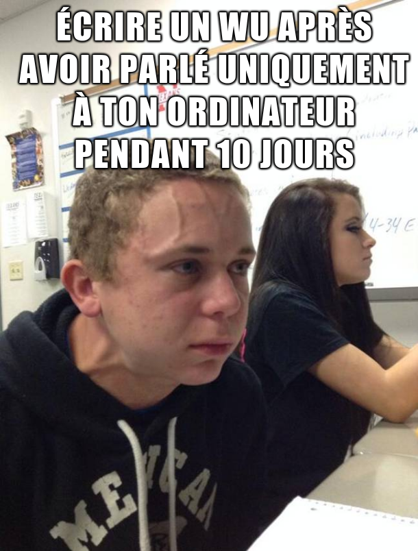

# **FCSC 2021 - Write-up**

*Par loulous24*

## **Contexte**

Voici quelques write-ups écrits pour les qualifications du FCSC 2021. Il s'agit du France CyberSecurity Challenge organisé par l'ANSSI pour concourir au concours européen dans l'équipe française.

J'ai flagué principalement en hardware et en reverse. Je les ai rédigés après 10 jours d'après donc si vous ne comprenez pas quelque chose, n'hésitez pas à m'envoyer un message.

*MERCI à toute la team de l'ANSSI pour vos challenges, ils étaient géniaux, j'ai pas pu tout regarder mais c'était vraiment chouette !!*