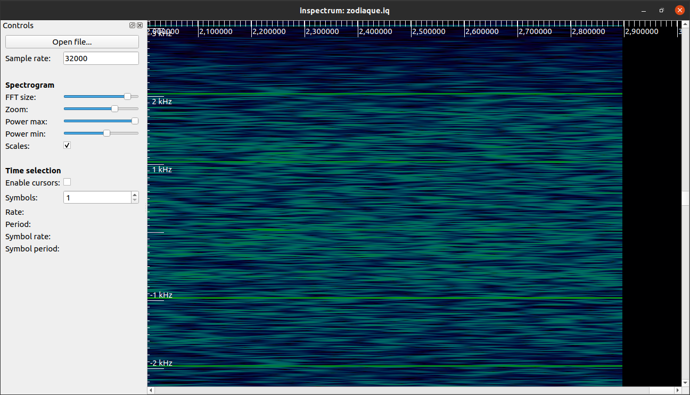
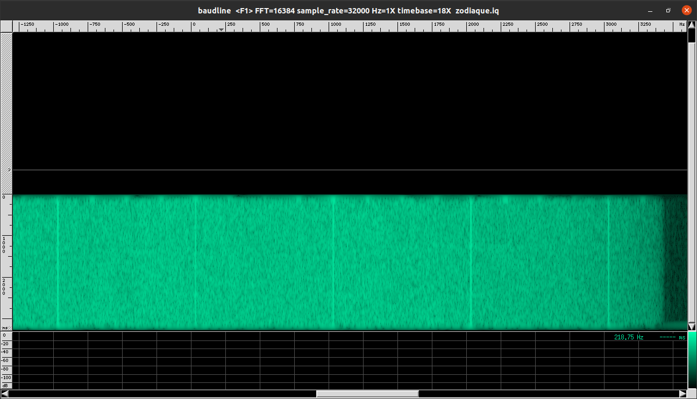
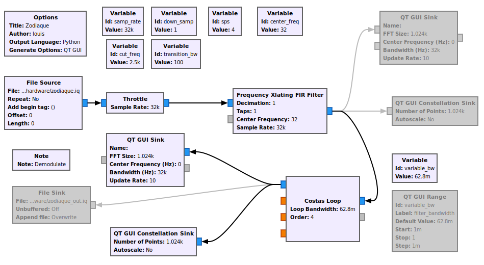
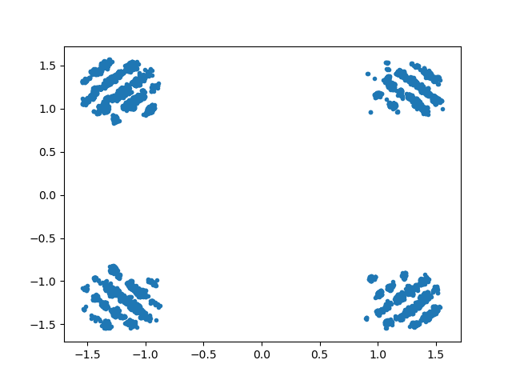
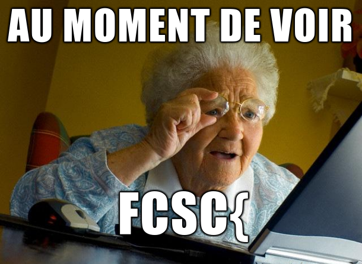

# **FCSC 2021 - Write-up**

*Par loulous24*

## **Zodiaque**

#### **Analyse initiale**

C'est un challenge de radio un peu sympa, on est là pour s'amuser, c'est parti !!

Pour voir les bases de l'analyse du signal, je vous conseille d'aller voir mon [WU du concours de l'année dernière sur les challenges hardware du FCSC](https://github.com/loulous24/FCSC/blob/master/FCSC2020/WU_hardware.md). Je vais réexpliquer certaines choses ici mais ça donne un bon complément.

Comme d'habitude, la première chose à faire est de regarder l'allure du signal. On peut regarder ça avec python de cette façon. Cependant, `baudline` ou `inspectrum` sont de petits outils assez simples pour avoir une première vue du challenge. Savoir faire l'affichage sur python reste important

```python
data = numpy.fromfile("challenge.iq", dtype=numpy.complex64)
plt.figure(1)
plt.specgram(data, Fs=sampling_freq, NFFT=2**10, pad_to=2**10)
plt.figure(2)
plt.plot(data)
```





Avec de bons yeux, on remarque que le signal n'est pas centré et est décalé de 32Hz. Il est temps de passer à Gnu Radio pour le décaler et faire l'analyse plus en profondeur.

#### **Analyse avec Gnu Radio**



Là j'ai mis toute l'analyse mais on commence d'abord par mettre uniquement le bloc Xlating (signifiant translating, on a l'air con la première fois qu'on l'apprend). On se rend compte en affichant le signal en sortie que l'on a une **4-QPSK**.

C'était annoncé dans le challenge mais on peu le faire à l'aveugle, c'est plus drôle. Cependant, le calage avec les 32 Hz n'est pas parfait. On peut mettre une **costas Loop** en plus pour le caler plus proprement et être sûr que ça fonctionne. On comprend alors le nom du challenge, zodiaque comme la constellation qui est le bloc qui permet de voir la QPSK correctement.

#### **Analyse avec python**

C'est là où j'ai perdu beaucoup de temps pour rien... J'ai voulu décoder le signal avec gnu radio avec les blocs de décodage de QPSK mais *il ne faut jamais faire ça*. Je laisse à chaque fois une chance à ces blocs qui font tout automatiquement mais *c'est une mauvaise idée*.

J'ai voulu retrouver ma constellation dans python et je me suis rendu compte qu'il n'existait pas d'affichage dynamique du signal en constellation. En fait, une constellation est l'affichage d'un point complexe dans le plan complexe. Quelques recherches sur les signaux `.iq` permettent de s'en persuader.

J'en ai codé un. Il est dynamique, il est beau est stylé, tout ce qu'on aime...

```python
import numpy as np
import matplotlib.pyplot as plt
import matplotlib.animation as animation

sampling_freq = 32e3

data = np.fromfile("zodiaque_out.iq", dtype = np.complex64)[::]
data_x, data_y = np.real(data), np.imag(data)

fig, ax = plt.subplots()
line, = ax.plot([], [], '.')

def init():
    xdata, ydata = [], []
    line.set_data([],[])
    ax.set_xlim(-2, 2)
    ax.set_ylim(-2, 2)
    return line,

def animate(i):
    # line.set_data(data_x[max(0,i-10):i], data_y[max(0,i-10):i])
    line.set_data(data_x[:i], data_y[:i])
    return line,

ani = animation.FuncAnimation(fig, animate, init_func=init, frames=len(data), blit=True, interval=2, repeat=False)
ax.plot(data_x, data_y, '.')
```

J'affiche les points depuis le début en en ajoutant un à chaque frame. On peut régler la vitesse pour comprendre ce qu'il se passe réellement.

### **Le décodage**

On voit qu'en fait il faut prendre un point sur 8 pour avoir les bonnes informations. Le signal a l'air cohérent. Maintenant, il faut trouver quel a été l'encodage du signal.



Il y a plusieurs possibilités. La plus simple est d'associer à chacun des quatre points les symboles parmis `{"00", "01", "10", "11"}`. On peut tester toutes les permutations pour trouver la bonne.

```python
from itertools import permutations

data_quant = []
for i, (x, y) in enumerate(zip(data_x, data_y)):
    if x >= 0.8 and y >= 0.8:
        data_quant.append(3)
    elif x >= 0.8 and y <= -0.8:
        data_quant.append(2)
    elif x <= -0.8 and y >= 0.8:
        data_quant.append(1)
    elif x <= -0.7 and y <= -0.8:
        data_quant.append(0)
    else:
        print(f"Error {i} : {x} - {y}")

mapping = {0: "00", 1: "01", 2: "10", 3: "11"}

for perm in permutations([0,1,2,3]):
    bits = []
    for x in data_quant:
        bits.append(mapping[x])
    binaire = "".join(bits)[:64]
    result_bytes = bytes(int(binaire[i : i + 8], 2) for i in range(0, len(binaire), 8))
    resultat = result_bytes.decode()
    print(resultat)
```

Sauf que cela ne fonctionne pas. On peut alors se dire qu'on est dans un encodage différentiel, ce qui compte n'est pas le symbole en soi mais sa dynamique. En fait, en analysant la première solution dans [CyberChef](https://gchq.github.io/CyberChef/), on se rend compte que la première méthode d'encodage était la bonne mais qu'on avait manqué un bit en reconnaissant le début de la séquence `"SYNCSYNCSYNC"`. Je ne l'avais pas vu tout de suite mais c'est en déchiffrant tout que ça devient clair !!


