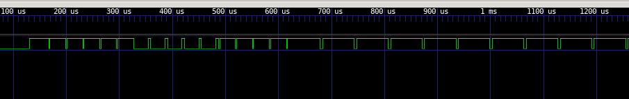
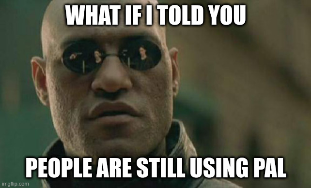
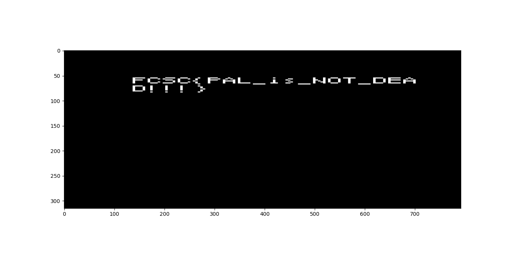
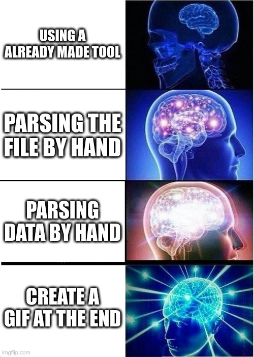

# PALeoTV
Write-up by *loulous24* **CC-BY-NC-SA 3.0**

***HARDWARE*** challenge

## Introduction

PALeoTV is a challenge of the FCSC 2023 in the hardware category.

```
Afin de dissimuler ses communications, un malfrat a décidé d'utiliser une diffusion par ondes radio de vidéos de type PAL particulière pour discuter avec ses acolytes. Il espère qu'à l'aire des diffusions numériques, il restera discret.

Vous avez intercepté grâce à votre SDR une communication sensible, mais n'avez pas vraiment le matériel pour décoder le signal PAL ! Vous savez néanmoins que le malfrat utilise un récepteur PAL avec une TV noir et blanc (donc sans luminance ni chrominance supplémentaire) de résolution de 768 pixels par ligne et du 576i (classique pour du PAL), et que le signal ne contient que de la vidéo (pas d'audio).

Vous avez réussi à numériser dans capture.vcd les signaux analogiques en isolant le signal de synchronisation ainsi que le signal de données utiles. Vous êtes confiant dans la possibilité de décoder ce signal PAL pour trouver le message secret !
```

## Beginning of the challenge

So this challenge is about the PAL protocol which is an analog protocol but we have a digital capture. Let's understand this.

[This page](http://martin.hinner.info/vga/pal.html) is a gold mine for having all the information required to understand the video.

So after opening it with GTKWave, we can see the synchronisation signal and a synchronisation at the begining.



So it is a confirmation that it is PAL. On this picture, there are the equalising pulses (short 0 and long 1), the vertical sync (long 0 and short 1) pulses and the equalising pulses again. Two pulses for equalisation or vertical syncing are 64 µs which is the duration of a standard line.

Now the challenge is to understand the structure and get the data from these signals.



## Structure of a PAL signal

The PAL synchronisation is done with a drop to -0.3 V during 4.7 µs and then a signal for one line the synchronisation and the data for one line lasts 64 µs.

There are 625 lines but there are interlaced. It means that one frame of 312.5 lines over two is for odd lines and the other one is for even lines. To know that it is another line, we can see the drop in the sychronisation data and to see that it is another frame, checking for equalising pulses and vertical sync pulses.

## Bring a python into the room

### Decoding the file

Now, this is the time to decode the file. It is a [vcd capture](https://en.wikipedia.org/wiki/Value_change_dump). I tried a parser but finally I did one myself (it does not respect the standard, just for decoding this file). I parse the headers and then the data. Lines that change time begin with `#`, the other one with a character defined in the headers.

```python3
with open("capture.vcd", "r") as capture_file:
    line = ""
    definitions = {}

    while True:
        line = capture_file.readline().rstrip('\n')
        if len(line) == 0 or line[0] != '$':
            break
        words = line.split()
        if words[-1] != "$end":
            print(f"Error reading header {line}")
        keyword = words[0]

        if keyword == "$enddefinitions":
            line = capture_file.readline().rstrip('\n')
            break
        definitions[keyword] = ' '.join(words[1:-1])

    wires = {'!': "D0", '"': "D1"}
    time = {w: [] for w in wires.values()}
    rawData = {w: [] for w in wires.values()}
    t = 0
    while True:
        if len(line) == 0:
            break
        if line[0] == '#':
            t = int(line[1:])
        else:
            d = int(line[:-1])
            name = wires[line[-1]]
            time[name].append(t)
            rawData[name].append(d)

        line = capture_file.readline().rstrip('\n')
```

### Decoding the data

To decode the data, I follow the synchronisation data and when there is a line, I extract the useful raw data.

The possible timing for a `0` on the synchronisation data are 2.35 µs for an equalisation phase which is follow by a 1 of duration 29.65 µs (or 61.65 every 625 lines but in this challenge, it is not the same as in the source and only every 312 lines), 27.3 µs for vertical sync synchronisation (followed by a 1 of duration 4.7 µs) or a normal line synchronisation of 4.7 µs which has to be followed by a 1 during 59.3 µs.

When a normal line synchronisation is detected, the program start to see if there was changes on the useful data signal during this phase and adding a line with all the changes relatively to the rising edge of the synchronisation signal.

```python3
last_t = time["D1"][1]
iData = 1
iSync = 2
parsedData = []
lines_time = []
while iSync < len(time["D1"])-1:
    t = time["D1"][iSync]
    d = rawData["D1"][iSync-1]
    dt = t - last_t
    if d == 0 and 2300 < dt < 2400:
        # short_sync
        iSync += 1
        last_t, t = t, time["D1"][iSync]
        d = rawData["D1"][iSync-1]
        dt = t - last_t
        if d == 1 and 29600 < dt < 29700:
            parsedData.append("Short sync")
        elif d == 1 and 61600 < dt < 61700:
            parsedData.append("Short sync (double)")
        else:
            print("Wrong short sync at {last_t}")
    elif d == 0 and 27200 < dt < 27400:
        # long_sync
        iSync += 1
        last_t, t = t, time["D1"][iSync]
        d = rawData["D1"][iSync-1]
        dt = t - last_t
        if d == 1 and 4600 < dt < 4800:
            parsedData.append("Long sync")
        else:
            print("Wrong long sync at {last_t}")
    elif d == 0 and 4600 < dt < 4800:
        # line sync
        iSync += 1
        last_t, t = t, time["D1"][iSync]
        d = rawData["D1"][iSync-1]
        dt = t - last_t
        if d == 1 and 59200 < dt < 59400:

			# real data, extracting the data on the other wire
            if time["D0"][iData] <= last_t:
                print(f"Data change out of the right place {time['D0'][iData]} <= {last_t}")
            elif time["D0"][iData] < t:
                new_data = [(0, rawData["D0"][iData-1])]
                while time["D0"][iData] < t:
                    relative_time = time["D0"][iData]-last_t
                    new_data.append((relative_time, rawData["D0"][iData]))
                    lines_time.append(relative_time)
                    iData += 1
                parsedData.append(new_data)
            else:
                parsedData.append([(0, rawData["D0"][iData-1])])

    else:
        print(f"Wrong symbols at {last_t}")
    last_t = t
    iSync += 1

i = 0
for data in parsedData:
    if type(data) is list:
        print(f"Data {i}")
        i += 1
    else:
        print(data)
        i = 0
```

There is a wrong symbol at the beginning because it does not respect the standard but after, there are 5 short sync followed by 5 long sync and 5 short sync again (with the last one doubled). Everything is the same thing as described except the fact that the last one should be doubled only one out of two.

### Extracting pixels from lines

So now, we have the synchronisation and the line data. To get the pixels we can keep one piece of data out of 75 to get approximately 768 pixels per line (a little bit more but some pixels are not displayed).

```
# transform x which is in [0, 59400) to a value in [0, 792)
def get_col(x):
    return x // 75

iLine = 0
frame = [[0 for i in range(get_col(59400))] for j in range(315)]
reset = False
frames = []
for data in parsedData:
    if type(data) is list:
        if reset:
            frames.append(frame)
            plt.imshow(frame, cmap='gray', vmin=0, vmax=255)
            plt.show()
            frame = [[0 for i in range(get_col(59400))] for j in range(315)]
            reset = False
        for iData, (t, d) in enumerate(data):
            for iCol in range(get_col(t), get_col(data[iData+1][0]) if iData+1 < len(data) else get_col(59400)):
                frame[iLine][iCol] = (255 if d == 1 else 0)
        iLine += 1
        #iLine += 2 # It was for frame interleaving
    elif data == "Short sync" or data == "Long sync":
        reset = True
        iLine = 0
    elif data == "Short sync (double)":
        #reset = False # When there is a short sync (double), we should have received half of the lines but it is not the case so we reset also
        #iLine = 1
        reset = True
        iLine = 0
    else:
        print(f"Something wrong when decoding pixels with {data}")
```

Then we can see all of the frames and get this one. It demonstrates that there was no interlacing because the flag was only on one frame which is only half of the lines.



## Seeing the real TV

We can go a little bit further by using the `matplotlib.animation` class to print the different pictures in a row.

```python3
import matplotlib.animation as animation

def update(frame):
    implot.set_data(frames[frame])
    return implot

ani = animation.FuncAnimation(fig=fig, func=update, frames=len(pictures), interval=1000//25)
plt.show()
```




## Useful links

- [PAL explanation page](http://martin.hinner.info/vga/pal.html)
- [PAL wiki article](https://en.wikipedia.org/wiki/PAL)
- [576i wiki article](https://en.wikipedia.org/wiki/576i)
- [625 lines wiki article](https://en.wikipedia.org/wiki/625_lines)
- [Interlaced video wiki article](https://en.wikipedia.org/wiki/Interlaced_video)
- [PAL format description](https://clearview-communications.com/wp-content/uploads/2020/04/Understanding-the-Video-Signal.pdf)
- [VCD capture file](https://en.wikipedia.org/wiki/Value_change_dump)


## Flag

Flag : `FCSC{PAL_is_NOT_DEAD!!!}`
