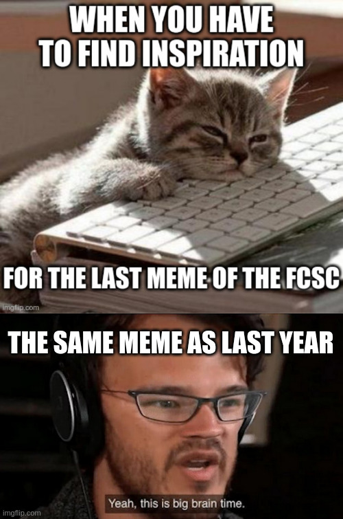

# **FCSC 2024 - Write-ups**

*By loulous24*

## **Context**

These are some write-ups written for the FCSC 2024. It is the French National qualifier and is organised by [ANSSI](https://cyber.gouv.fr/).

This year again, I got flags in all of the hardware challenges, some side channels and fault attacks, misc, rev, crypto and other stuff. Do not hesitate to send me a message if you have a question on a challenge I have not done a write-up for.

*Still a big thanks to each organiser. It is always one of the best CTFs I ever played.*

