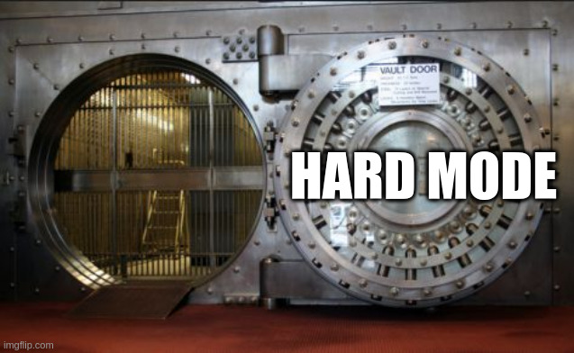

# Open sesame! *(Sésame, ouvre-toi)*

Write-up by *loulous24* **CC-BY-NC-SA 4.0**

***HARDWARE*** challenge

## Listening to the grotto

Sésame, ouvre-toi, Open sesame! in English, is a series of two hardware challenges of the FCSC 2024. Let's take a look at the descriptions (in French).

#### Sésame, ouvre-toi

```
    Votre ami a stocké un secret dans la configuration de son chargeur de démarrage. Il vous assure qu'il n'est pas possible de l'extraire car il faut connaître son mot de passe pour stopper l'autoboot et y accéder.

    Vous débranchez le disque NVMe stockant son système d'exploitation, vous remarquez alors que la machine démarre dans une sorte de shell. Serez-vous trouver un moyen d'accéder à son secret ?

    Note: sur cette machine, le pointeur d'instruction est initialisé à 0x00000000 au démarrage.

    On vous fournit un dump de ce chargeur de démarrage, mais configuré avec le mot de passe FAKEPASSWORD et sans secrets.
```

#### Sésame, ouvre-toi (harder)

```
    Votre ami a été impressionné que vous ayez pu retrouver son secret (challenge Sésame, ouvre-toi). Pour se venger, il met à jour son chargeur de démarrage avec une nouvelle configuration fortement durcie.

    Serez-vous capable d'accéder à son nouveau secret ?

    On vous fournit un dump de ce nouveau chargeur de démarrage, mais configuré avec le mot de passe FAKEPASSWORD et sans secrets.
    nc challenges.france-cybersecurity-challenge.fr 2301
```

Two bootloaders are provided, one for each challenges.

## Looking at the door

I worked last year with a submarine bootloader, [see it here](https://github.com/loulous24/FCSC/blob/master/FCSC2023/Sous_marin.md)
if you want to have an introduction to bootloaders with another challenge.

After launching the first challenge, it appears that [U-Boot](https://en.wikipedia.org/wiki/Das_U-Boot) is used as the bootloader.

```
    U-Boot 2023.07.02 (Jul 11 2023 - 15:20:44 +0000)

    DRAM:  24 MiB
    Core:  41 devices, 10 uclasses, devicetree: board
    Loading Environment from nowhere... OK
    In:    pl011@9000000
    Out:   pl011@9000000
    Err:   pl011@9000000
    Autoboot in 10 seconds
```

After 10 seconds, something is booted.

```
    ## Booting kernel from Legacy Image at 40200000 ...
       Image Name:   EFI Shell
       Created:      1980-01-01   0:00:00 UTC
       Image Type:   AArch64 EFI Firmware Kernel Image (no loading done) (uncompressed)
       Data Size:    1028096 Bytes = 1004 KiB
       Load Address: 00000000
       Entry Point:  00000000
       Verifying Checksum ... OK
       XIP Kernel Image (no loading done)

    No EFI system partition
    No EFI system partition
    Failed to persist EFI variables
    ## Transferring control to EFI (at address 40200040) ...
    Booting /MemoryMapped(0x0,0x40200040,0xfb000)
```

It appears that it is an [UEFI](https://en.wikipedia.org/wiki/UEFI) Shell (also something from the project Das U-Boot).

```
    UEFI Interactive Shell v2.2
    EDK II
    UEFI v2.100 (Das U-Boot, 0x20230700)
    map: No mapping found.

    Shell>
```

During the 10 seconds even if I try to write some characters, nothing appens and the UEFI boots every time. The goal is probably to send the password to have a bootloader shell.


To make it simple, the process of starting a computer is quite complex and requires a lot of steps. It is very low-level.

A quick recall, the bootloader is the first process to be loaded in memory and executed. It is often very tiny and in a different hardware piece than the hard drive (such as a non-volatile memory as a ROM, EEPROM or NOR flash). Its task is to initialise other pieces of software and to make them run. So here we have a 2 stages bootloading process.

The first stage is the bootlader by itself and the second stage is the UEFI (which do not launch another image).

One cool thing is that U-Boot stores its config parameters directly inside the bootlader so by doing a `strings bootloader.bin`, it is possible to find some interesting informations.

```
    bootargs=-delay 0
    bootcmd=bootm 0x40200000; poweroff
    bootdelay=10
    baudrate=115200
    loadaddr=0x40200000
    arch=arm
    cpu=armv8
    board=qemu-arm
    board_name=qemu-arm
    vendor=emulation
    boot_targets=qfw usb scsi virtio nvme dhcp
    fdt_addr=0x40000000
    fdt_high=0xffffffff
    initrd_high=0xffffffff
    kernel_addr_r=0x40400000
    pxefile_addr_r=0x40300000
    ramdisk_addr_r=0x44000000
    scriptaddr=0x40200000
```

So it is an ARM architecture and the code at address `0x40200000` is booted. After an exit, it is poweredoff (so it is not possible to go back to the bootloader).

## Inspecting the fist door

For the first challenge, I have done a decompilation of the bootloader using Ghidra. One of my main error at that time was to try to decompile with an ARM family whereas it is an ARM 64 bits (the name of the family is AARCH64, a little bit different). It is possible to check that it is 64 bits by doing a `strings bootloader.bin | grep -i 'aarch'` and seeing the line `aarch64-unknown-linux-gnu-gcc (GCC) 13.2.0`.

So, after opening it in Ghidra with family AARCH64 and little-endian, it is possible to see the password in clear text among the strings. I supposed the cross-reference was a reference from the main function. 

The code arround the string `FAKEPASSWORD` looks like that.

``` c
    printf((byte *)s_Autoboot_in_%d_seconds_00064fa3);
    uStack_54 = 0;
    local_stopkey = (char *)0x0;
    len_stopkey = 0;
    local_44 = 0;
    delaykey = (char *)FUN_0001df98((undefined **)s_bootdelaykey_00064fbb,uVar6,ppuVar13,in_x3,
                                    (char *)in_x4,(ulong)in_x5,(ulong)in_x6,in_x7);
    stopkey = (char *)FUN_0001df98((undefined **)s_bootstopkey_00064fc8,uVar6,ppuVar13,in_x3,
                                   (char *)in_x4,(ulong)in_x5,(ulong)in_x6,in_x7);
    if (delaykey == (char *)0x0) {
      delaykey = &DAT_0005f05f;
    }
    if (stopkey == (char *)0x0) {
      stopkey = s_FAKEPASSWORD_00064eef;
    }
    local_delaykey = delaykey;
    local_stopkey = stopkey;
    lVar10 = len(delaykey);
    len_delaykey = (uint)lVar10;
    if (0x40 < (uint)lVar10) {
      len_delaykey = 0x40;
    }
    cnt_input = 0;
    len_delaykey2 = len_delaykey;
    lVar10 = len(stopkey);
    len_stopkey = (uint)lVar10;
    if (0x40 < len_stopkey) {
      len_stopkey = 0x40;
    }
    if (len_delaykey < len_stopkey) {
      len_delaykey = len_stopkey;
    }
    do {
      uVar12 = is_something?();
      if ((int)uVar12 != 0) {
        if ((int)cnt_input < (int)len_delaykey) {
          uVar6 = read?();
          local_40[(int)cnt_input] = (char)uVar6;
          cnt_input = cnt_input + 1;
        }
        else {
          delaykey = local_40;
          for (iVar11 = 0; iVar11 < (int)(len_delaykey - 1); iVar11 = iVar11 + 1) {
            *delaykey = delaykey[1];
            delaykey = delaykey + 1;
          }
          uVar6 = read?();
          len_key = len_delaykey;
          if ((int)len_delaykey < 1) {
            len_key = 1;
          }
          local_40[(int)(len_key - 1)] = (char)uVar6;
        }
      }
      key_ptr = &local_delaykey;
      bVar1 = false;
      iVar11 = 2;
      while( true ) {
        len_key = *(uint *)(key_ptr + 1);
        ppuVar13 = (undefined **)(ulong)len_key;
        if ((len_key != 0) && (len_key <= cnt_input)) {
          ppuVar13 = (undefined **)(ulong)len_key;
          iVar4 = strncmp(local_40 + ((long)(int)cnt_input - (ulong)len_key),*key_ptr,
                          (long)ppuVar13);
          if (iVar4 == 0) {
            bVar1 = true;
          }
        }
        key_ptr = key_ptr + 2;
        if (iVar11 == 1) break;
        iVar11 = 1;
      }
      wait_long(10000);
      if (bVar1) goto LAB_000167d8;
      uVar6 = FUN_0000566c();
    } while (uVar6 <= (ulong)(lVar9 + (int)uVar3 * lVar7));
```

So there are two keys, a stop key and a delay key and `FAKEPASSWORD` is hardcoded as the default stopkey. After that, it is a piece of code that takes the n last characters entered and compares them with the stop key or the delay key.

So the key is perhaps stored inside the bootloader on the server. But is it possible to have an access to it ?

This is where the UEFI makes an appearance!!

## Looking back when we are inside

So even if the UEFI is the second stage process, it is still possible to access to the first stage of the process, if it is not erased. But the UEFI is a shell, it is not a direct backdoor to the entire system.

There are several commands available. I have tested all of them (but not all at the beginning, it was one of my main error, see later). The useful ones here are `help` for having a list and some infos about the other commands, `cls` to clear the string (it is quickly a landfill) and `dmem` to inspect the content of the memory. 

This is the help manual about dmem for the format of the command parameters.

```
    Displays the contents of system or device memory.

    DMEM [-b] [address] [size] [-MMIO]

      -b      - Displays one screen at a time.
      -MMIO   - Forces address cycles to the PCI bus.
      address - Specifies a starting address in hexadecimal format.
      size    - Specifies the number of bytes to display in hexadecimal format.

    NOTES:
      1. This command displays the contents of system memory or device memory.
      2. Enter address and size in hexadecimal format.
      3. If address is not specified, the contents of the UEFI System Table
         are displayed. Otherwise, memory starting at the specified address is displayed.
      4. Size specifies the number of bytes to display. If size is not specified,
         512 bytes are displayed.
      5. If MMIO is not specified, main system memory is displayed. Otherwise,
         device memory is displayed through the use of the
         EFI_PCI_ROOT_BRIDGE_IO_PROTOCOL.
```

It is possible to inspect the memory that way. When using the UEFI, there are tons of [ANSI escape codes](https://en.wikipedia.org/wiki/ANSI_escape_code). So I decided to write a piece of code in Python with the help of [pwntools](https://github.com/Gallopsled/pwntools) to parse directly the output of the UEFI. At that point, I had in mind to code something for extracting big pieces of memory.

It sends the command with the write format and return the hexdump directly or parse it and remove the ANSI codes.

``` py
def readaddress(io, addr, size=0x1000, hexdump=True):
    io.sendline(f"dmem {addr:x} {size:x}".encode())
    io.readuntil(b"Memory Address ")
    io.readline()
    data = io.readuntil(b"\x1b[0;37;40m\x1b[25;1H\x1b[1;33;40mShell> \x1b[0;37;40m\x1b[0;37;40m", drop=True).replace(b"\x1b[0;37;40m  ", b"").replace(b"\r", b"")
    if hexdump:
        return data
    final_data = bytearray()
    for l in data.split(b"\n"):
        try:
            line_data = binascii.unhexlify(l[10:l.find(b' *')].replace(b'-', b'').replace(b' ', b''))
        except binascii.Error:
            print(l)
            print(l[10:l.find(b' *')])
            print(l[10:l.find(b' *')].replace(b'-', b' '))
            exit()
        final_data.extend(line_data)
    return bytes(final_data)
```

With that, it is possible to look at the memory around the same position as where `FAKEPASSWORD` is in `bootloader.img`.

``` py
extract = readaddress(io, 0x64e00)
print(extract)
```

The password is just before the string `HUSH_VERSION`, which the same way as in the file given. It is `b3stfr1end98`. Is it a reference to the['98 World Cup](https://en.wikipedia.org/wiki/1998_FIFA_World_Cup) or to [Windows 98](https://en.wikipedia.org/wiki/Windows_98) or something else? I don't know!

So now, it is possible to enter it during the autoboot process and profit!

I knew already how to read parameters of U-Boot bootloader from last year with the command `env print -a`.

```
    arch=arm
    baudrate=115200
    board=qemu-arm
    board_name=qemu-arm
    boot_targets=qfw usb scsi virtio nvme dhcp
    bootargs=-delay 0
    bootcmd=bootm 0x40200000; poweroff
    bootdelay=10
    cpu=armv8
    fdt_addr=0x40000000
    fdt_high=0xffffffff
    fdtcontroladdr=415cf9b0
    initrd_high=0xffffffff
    kernel_addr_r=0x40400000
    loadaddr=0x40200000
    printflag=hash sha256 40904000 1000 flaghash; echo FCSC{$flaghash};
    pxefile_addr_r=0x40300000
    ramdisk_addr_r=0x44000000
    scriptaddr=0x40200000
    stderr=pl011@9000000
    stdin=pl011@9000000
    stdout=pl011@9000000
    vendor=emulation
```

The flag can be obtained with another command that gives.

```
    sha256 for 40904000 ... 40904fff ==> XXX
    FCSC{XXX}
```

## Trying to break a metal door (harder mode)



So back again with a second bootloader. Same protocol, puting it into Ghidra. Now it is looking for a parameter named `bootstopkeysha256`. It is possible to find a sha256 string `b2986a18ce759031c3215a13d01f8290193b2dac8556a7b4a784197955806310` which is the SHA256 of the string `FAKEPASSWORD`. The rest of the code is also looking for characters, there is several hash functions defined inside the bootloader and a array of struct pointing to these functions. The code here is using the function `sha256`.

I extracted part of the remote bootloader to see its secrets. The remote sha256 is `12eb7b15dc2f4aed25371a49f3048c56fda5eacb600196e3f5aa842757412c7e` and the printflag command is `printflag=hash sha256 40900100 1000 flaghash; echo FCSC{$flaghash};`.

This is where I spent a lot of time for wrong reasons.

I tried to bruteforce the flag with ghidra. As the first final password was weak, I tried many combination around the `rockyou.txt` and some derivations with the number `98`. I also ran a bruteforce attack up to 8 characters.

During that time, I examined the code closely to see if there was a vulnerabilty hidden inside the code that allows to bypass the check. Nothing comes out.

I tried to look at the memory directly from the UEFI Shell but it was not working. I knew that the hash cracking was probably not the right solutions but I was not able at all to understand why it was not possible to look at the memory around `0x40900000`. Last year, it was understandable, something was connected only remotely so I thought here it was something only accessible from the bootloader and disconnected after that.

I was a little bit hopeless and it was my last hardware challenge so I decided to try to do other challenges.

## The light at the end of the dark tunnel

The day after, I started again (also because my oponent was showing off. First of all, I was not really conscious that it was possible to auto-modify the code of the UEFI. No memory regions are protected at that point.

This is where 2 other useful commands arrives. `memmap` is useful for seeing the memory mapping and `mm` to modify the memory. This is the output of `memmap`.

```
    Type       Start            End              # Pages          Attributes
    Available  0000000040000000-00000000402CDFFF 00000000000002CE 0000000000000008
    BS_Data    00000000402CE000-00000000403BEFFF 00000000000000F1 0000000000000008
    LoaderCode 00000000403BF000-00000000404B9FFF 00000000000000FB 0000000000000008
    BS_Data    00000000404BA000-00000000404BDFFF 0000000000000004 0000000000000008
    ACPI_Recl  00000000404BE000-00000000405C0FFF 0000000000000103 0000000000000008
    BS_Data    00000000405C1000-00000000405C1FFF 0000000000000001 0000000000000008
    RT_Data    00000000405C2000-00000000405C3FFF 0000000000000002 8000000000000008
    BS_Data    00000000405C4000-00000000405C4FFF 0000000000000001 0000000000000008
    RT_Data    00000000405C5000-00000000405C6FFF 0000000000000002 8000000000000008
    BS_Data    00000000405C7000-00000000405C7FFF 0000000000000001 0000000000000008
    RT_Data    00000000405C8000-00000000405CBFFF 0000000000000004 8000000000000008
    BS_Data    00000000405CC000-00000000405CEFFF 0000000000000003 0000000000000008
    BS_Code    00000000405CF000-000000004174FFFF 0000000000001181 0000000000000008
    RT_Code    0000000041750000-000000004175FFFF 0000000000000010 8000000000000008
    BS_Code    0000000041760000-00000000417FFFFF 00000000000000A0 0000000000000008

      Reserved  :              0 Pages (0 Bytes)
      LoaderCode:            251 Pages (1,028,096 Bytes)
      LoaderData:              0 Pages (0 Bytes)
      BS_Code   :          4,641 Pages (19,009,536 Bytes)
      BS_Data   :            251 Pages (1,028,096 Bytes)
      RT_Code   :             16 Pages (65,536 Bytes)
      RT_Data   :              8 Pages (32,768 Bytes)
      ACPI_Recl :            259 Pages (1,060,864 Bytes)
      ACPI_NVS  :              0 Pages (0 Bytes)
      MMIO      :              0 Pages (0 Bytes)
      MMIO_Port :              0 Pages (0 Bytes)
      PalCode   :              0 Pages (0 Bytes)
      Unaccepted:              0 Pages (0 Bytes)
      Available :            718 Pages (2,940,928 Bytes)
      Persistent:              0 Pages (0 Bytes)
                  --------------
    Total Memory:             24 MB (25,165,824 Bytes)
```

There are several interesting data here. One is coming from the output of the first stage bootloader: the UEFI is at 0x40200000. It is an part available inside memory. From the help page of `dmem` (see above), it is possible to have the address of the UEFI System Table which is 0x41751B88. It is inside an `RT_Code` region.

It is by trying to understand how `mm` was working that I figured out that the message after doing `dmem 40900100` (the memory region used to compute the flag) was really weird.

```
    dmem ACCESS DENIED: Invalid argument - '<null string>'
```

Why is it an access denied ? Is it that it is not possible to access it or is it, in fact, not defined inside the memroy mapping even if it iswritten as so.

Then I understood that it is still possible to access the memory just before the flag up to 0x409000fe and just after including 0x40901100. It looked really suspicious.

## The hardened double door

So I decided to extract the UEFI with my python code. It is too slow for downloading it at once

``` py
extracted_efi = bytearray()
#begin = 0x40200000
#begin = 0x402d0000
end = 0x402fb040
size, step = end-begin, 0x2000
with open("efi.cpio", "ab") as efi_extracted:
    for i in range(begin, end, step):
        part_i = readaddress(io, i, size=step, hexdump=False)
        extracted_efi.extend(part_i)
        efi_extracted.write(part_i)
        print(f"Received address 0x{i:x}-0x{i+step-1:x}, {(i-begin+step)/size*100}%")
```

It took two downloads to have the complete file of 1008Ko. It appears to be a CPIO archive (classical format for a uImage).

I opened it in Ghidra, saw a string `dmem ACCESS DENIED` and saw the cross-reference. This piece of code is really interesting (and suspicious).

``` c
    if ((local_30 + local_28 < (byte *)0x40900100) || (0x409010ff < local_28)) {
      if (bVar4) goto LAB_00039914;

      [...]
      }
   }
    else {
      in_x6 = unaff_x22;
      FUN_00016d60(-1,-1,0,0x22c,DAT_000f4588,L"dmem ACCESS DENIED",unaff_x22,in_x7);
      uVar8 = 2;
    }
```

So there is a hardcoded check to avoid looking at the memory at that specific place!!!! Not only the bootloader was patched but also the UEFI (the double door).

## Stealing the treasure

Now, it is time to think as thieves and to find a way to bypass it. I have choosen to patch the UEFI directly into memory to step over this condition and be able to perform the memory extraction.

So I used mm to modify the data stored at address 0x40239928 (to bypass the jump). However, it was not working because it is not the place where the executed code is. This is where the uImage is but it is placed elsewhere for the execution. By looking at the memory map, I figured out that the LoaderCode part size was exactly the size of the UEFI. I looked at the beginning and it was the same file. So I patched at that point 0x403BF00+000398e8 to change the jump condition of the check.

```
    mm 403f88e8 0x14000044 -w 4
```

And now `dmem` is working again. This command prints well the memory.

```
    dmem 40900100 1000
```

To compute the sha256, I did a snippet to do the patch, extract the memory and hash it.

``` py
shell_header = io.readuntil(b"Shell> \x1b[0;37;40m\x1b[0;37;40m")

io.sendline(f"mm 403f88e8 0x14000044 -w 4".encode())
shell_header = io.readuntil(b"Shell> \x1b[0;37;40m\x1b[0;37;40m")

data = readaddress(io, "40900100", size=0x1000, hexdump=False)
flag_hex = hashlib.sha256(data).hexdigest()
print(f"FCSC{{{flag_hex}}}")
```

And this is finally the second flag!!

## Profit


As a summary, this is a memory map of what is really interesting here.

```
    0x00000000-0x0008b198 : ROM (with u-boot)
    0x40200000-0x402fb040 : EFI (uImage with EFI uncompressed)
    0x403bf000-0x404ba000 : EFI (UEFI running)
    0x41751000-0x417dc198 : RAM u-boot
```

A good rest after finally locking this category... So this was a really nice challenge ! A big thanks to `erdnaxe` for the challenge (and to th eorganisers).

## Some interesting gold nuggets

-   [The description of the PE format](https://en.wikipedia.org/wiki/Portable_Executable)
-   [How to get the size of a PE](https://stackoverflow.com/questions/34684660/how-to-determine-the-size-of-an-pe-executable-file-from-headers-and-or-footers)
-   [Description of memmap UEFI](https://techlibrary.hpe.com/docs/iss/proliant-gen10-uefi/v28071734.html)
-   [The U-Boot documentation](https://u-boot.readthedocs.io/en/latest/)
