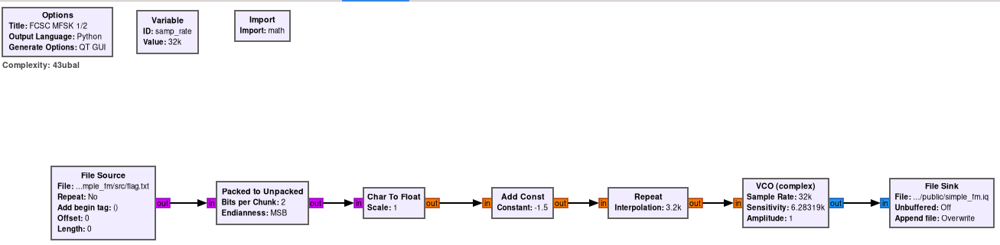
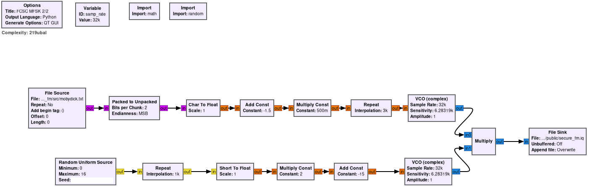
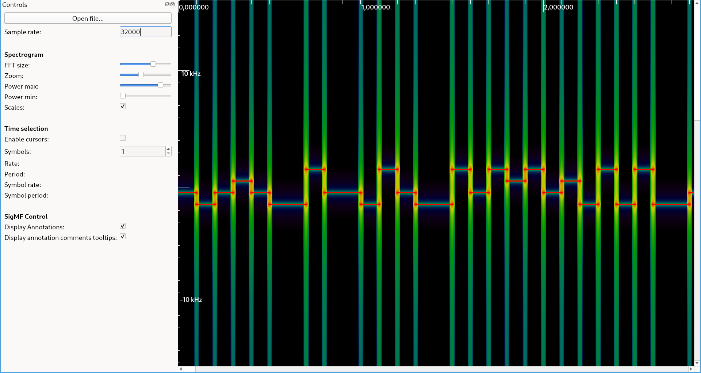
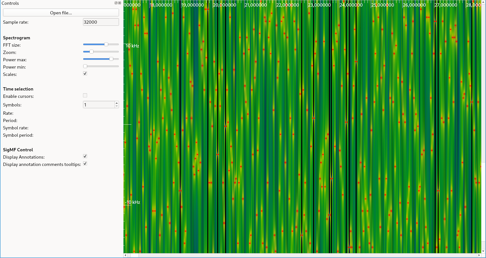
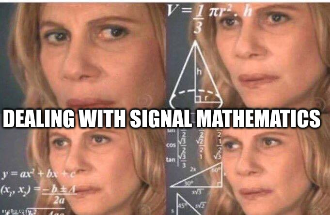
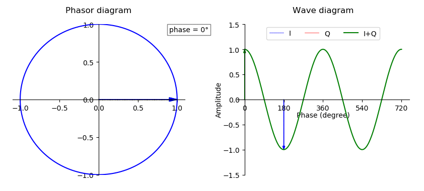
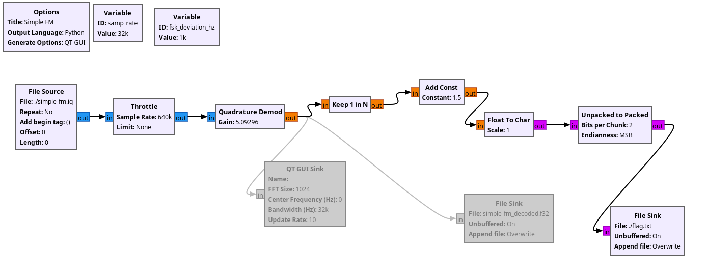
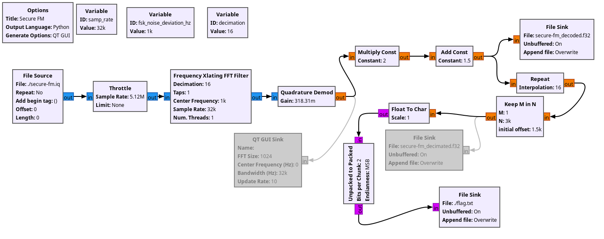

# Simple / Secure FM
Write-up by *loulous24* **CC-BY-SA 4.0**

***HARDWARE*** challenge

## Introduction

Simple FM and Secure FM is a series of challenges of the FCSC 2023 in the hardware category. Those challenges have been solve arround 20 and 30 times but I make this write-up to do some mathematical explanation and see how it is possible to finish them with a small amount of blocks and using [GnuRadio](https://www.gnuradio.org/) only.

What is interesting here are the GnuRadio flowgraphs of those challenges.

## Beginning of the challenges

When begining those kind of challenges, it is always a good option to open them inside [inspectrum](https://github.com/miek/inspectrum) to see the structure of the signal. The data is encoded with complex 32-bit floating point samples so the extension to choose before opening them is `*.cf32`.

So here, the X axis represents time and Y axis frequencies. More red a region is, more this frequency is there at that amount of time. On the simple FM, it is clearly horizontal lines which means that it is the same frequency during a given amount of time. This frequency is changing over time but takes only a finite number of different values. For simple FM, only 4 values are possible.

This is called a [Frequency Shift Keying](https://en.wikipedia.org/wiki/Frequency-shift_keying) (FSK) modulation.

For the secure FM, it is possible to see the same thing as for simple FM but the number of possible values is way bigger.

## A theoretical point of view

A periodic signal can be decomposed in a sum of oscillators which are cosinus and sinus of different frequencies. The presence or not of those frequencies is what gives the ouput of `inspectrum`. It is possible to get them doing the Fourier Transform.

A magical tool in signal processing is complex numbers ! It is a way to have sine and cosine at the same time thanks to this property.

$$
e^{2 i \pi f t} = \cos(2 \pi f t) + i \sin(2 \pi f t)
$$

And this is exactly why the file given contain complex numbers. A visual representation of that is a point moving around a circle. The X coordinate is the cosine and the Y coordinate isthe sine. A fun thing happening here (which can be hard to understand at the beginning) is the negative frequency. It is juste having the point moving backwards on the circle. At the end, there are interesting videos to have a better representation.

A sinusoidal signal has three main components, its amplitude $A$, its frequency $f$ and its initial phase $phi_0$. A more complex signal can be written as the sum of such sinusoidal signals.

$$
s(t) = A e^{i2\pi f t  + \phi_0}
$$

The second big thing which will be important here is sampling. It is the process to convert a continuous-time signal (a value at every moment) to a discrete-time signal (a value only at some moment). It is really impactful on the signals. For example, the [Nyquist–Shannon sampling theorem](https://en.wikipedia.org/wiki/Nyquist%E2%80%93Shannon_sampling_theorem) explains that it is not possible to see frequencies $f$ bigger than $f_s/2$ where $f_s$ is the sampling frequency (the frequency of the measurement).

An effect of the Nyquist–Shannon sampling theorem is that by taking one point every $N$ times (which is called decimation), the sampling frequency $f_s$ is divided by $N$. The frequencies above $f_s/(2N)$ do not disappear. They are shifted inside the range $[-f_s/(2N), +f_s/(2N)$. It is the same effect as taking for each frequencies the frequency modulo $f_s/N$. This is also why when doing sampling, before the sampling process, there is a filter that avoids parasitic frequencies (it is a low-pass filter).

## Putting everything together

Now, we can understand one of the most useful block in gnuradio which is [Quadrature Demod](https://wiki.gnuradio.org/index.php?title=Quadrature_Demod). It goals is to extract the frequency of a pure sinusoidal signal.

$$
\mathrm{arg}\left(x[n] \, \bar x [n-1]\right) = \mathrm{arg}\left(A e^{j2\pi\left( \frac f{f_s} n + \phi_0\right)} \overline{A e^{j2\pi( \frac f{f_s} (n-1) + \phi_0)}}\right) \\
= \mathrm{arg}\left( A^2 e^{j2\pi \frac f{f_s}}\right) \\
= \frac{f}{f_s}
$$

So this is useful for extracting the [instantaneous frequency](https://en.wikipedia.org/wiki/Instantaneous_phase_and_frequency) of a sinusoidal signal.

As we are dealing with signals that have the same frequency over a given amount of time, this will give the frequency.

## Solving the first challenge

For the first challenge, this is all we have to do, each character have been repeated during a period of 100ms and modulated in frequency. To reverse the process, it is just needed to do a quadrature demod with a gain of `samp_rate/(2*math.pi*fsk_deviation_hz)` where `fsk_deviation_hz` is 1kHz. The next steps are taking one sample every 3200, adding the constant and unpacking the value.

## Solving the second challenge

This is where everything is interesting and why this write-up goes into many details. The solution is simple but the reasoning behind is not.

By looking at the graph, it is possible to see that two sinusoidals signals are multiplied together. One is the giving the flag and the other one is noise. The previous notation when multiplying two signals gives

$$
s_1[n]*s_2[n] = A_1 e^{i2\pi \frac{f_1}{f_s} n + \phi_1} * A_2 e^{i2\pi \frac{f_2}{f_s} n + \phi_2} \\
= A_1 * A_2 e^{i2\pi \{frac{f_1 + f_2}{f_s} n + \phi_1 + \phi_2}
$$

The frequencies are added!!! The noise frequencies are for $l$ going between 0 and 15 included $-15 + 2l$ kHz. The flag frequencies are -0.75 kHz, -0.25 kHz, +0.25 kHz and +0.75 kHz. So be removing the multiple of 2kHz, it is possible to retrieve the flag frequencies.

So from now, two solutions, either doing the same as before, extracting the float values and doing a python script to convert those values back.

OR!! Thinking about decimation...

I said before that doing a decimation by N is the same thing as doing a modulo by $f_s/N$. Here, the modulo wanted is 2kHz and $f_s$ is 32 kHz so it is needed to do a decimation with $N = 16$. Be cautious that after the decimation, the frequency for each block is $f_s/N$.

Another thing is that the noise frequency have an offset of -15 kHz which is 1 kHz modulo 2 kHz. It is also possible to remove it by doing a frequency translation with the block [Frequency Xlating FFT Filter](https://wiki.gnuradio.org/index.php/Frequency_Xlating_FFT_Filter). A translation of 1 or -1 kHz is perfect to get an even offset that will disappears after the decimation. This blocks can directly perform a decimation after the translation.

The gain of the quandrature demod is now `(samp_rate/decimation)/(2*math.pi*fsk_noise_deviation_hz)` because of the decimation. The end of the graph is almost the same except that with the decimation, it is needed to take 1 every (3000 / 16) points for converting back to the flag. The last tip is to repeat 16 times and take one over 3000. The effect is exactly the same. Be careful with the block Keep M in N because it takes M points in a row and here, it is needed to take the points spaced regularly.

It was a long path. Probably longer than the time I solved this challenge but I really wanted to do it to explain how it works rather than doing a write-up on a complex challenge but with less theory behind.

## Interesting sources to look at

- [A visual video about the Fourier decomposition (in French)](https://www.youtube.com/watch?v=uazPP0ny3XQ)
- [Introduction of Fourier transform by 3Blue1Brown](https://www.youtube.com/watch?v=spUNpyF58BY)
- [GnuRadio wiki](https://wiki.gnuradio.org/index.php/Main_Page)
